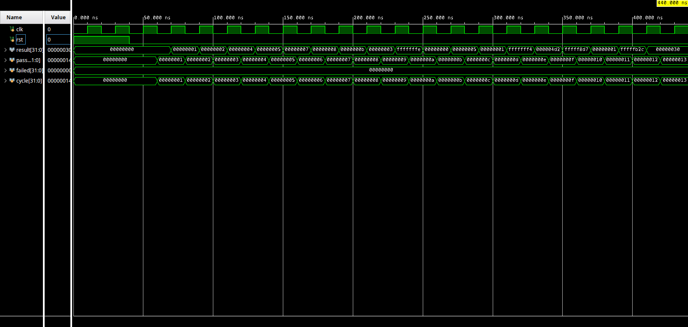

# RISC-V Single-Cycle Processor

A complete single-cycle RISC-V processor implemented in Verilog. Executes one instruction per clock cycle and supports R-type, I-type, load, and store instructions. Verified against a 20-instruction test program with all tests passing.

## Components

### Processor (Top Level)
- Wires together Controller, ALU Controller, and Datapath
- Exposes only `clk`, `reset`, and `Result` externally

### Controller
- Decodes 7-bit opcode into 5 control signals and 2-bit ALUOp
- Purely combinational using `assign` statements
- Supports R-type, I-type, LW, and SW opcodes

### ALU Controller
- Decodes ALUOp + Funct3 + Funct7 into 4-bit operation code
- Purely combinational boolean equations
- Drives the ALU directly

### Datapath
- Integrates all execution components
- PC increments by 4 each cycle with synchronous reset
- Outputs opcode, funct3, funct7 for the control units

### Instruction Memory
- 64x32 memory pre-loaded with 20 test instructions
- NOP at index 0 for synchronous reset compatibility
- Byte-addressable, word-aligned (uses addr[7:2])

### Register File
- 32x32 register array
- Dual-port asynchronous read
- Single-port synchronous write
- Register 0 hardwired to zero

### Immediate Generator
- Sign-extends immediates from instruction fields
- Supports I-type and S-type formats

### ALU
- 32-bit operations: ADD, SUB, AND, OR, NOR, SLT
- 4-bit control code input
- Generates zero, overflow, and carry flags

### Data Memory
- 128x32 memory (512 bytes)
- Synchronous write, combinational read
- Separate read/write enables

### 2:1 Multiplexers (32-bit)
- ALU source MUX: selects register data or immediate
- Writeback MUX: selects ALU result or memory data

## Supported Instructions

| Type | Instructions |
|------|-------------|
| R-type | `add`, `sub`, `and`, `or`, `nor`, `slt` |
| I-type | `addi`, `andi`, `ori`, `nori`, `slti` |
| Load | `lw` |
| Store | `sw` |

## Control Signals

| Signal | Width | Description |
|--------|-------|-------------|
| `reg_write` | 1 | Enable register file write |
| `mem2reg` | 1 | Select memory data for writeback |
| `alu_src` | 1 | Select immediate as ALU B operand |
| `mem_write` | 1 | Enable data memory write |
| `mem_read` | 1 | Enable data memory read |
| `alu_cc` | 4 | ALU operation code |
| `ALUOp` | 2 | Instruction class (R-type, I-type, LW/SW) |

## Files

### Design Sources
- `processor.v` — Top-level processor
- `controller.v` — Opcode decoder
- `alu_controller.v` — ALU operation decoder
- `data_path.v` — Datapath integrating all execution units
- `inst_mem.v` — Instruction memory
- `reg_file.v` — Register file
- `imm_gen.v` — Immediate generator
- `alu_32.v` — 32-bit ALU
- `mux_32.v` — 32-bit 2:1 multiplexer
- `data_mem.v` — Data memory

### Testbench
- `processor_tb.v` — Drives clk and reset, checks all 20 results

## Simulation

Run using Vivado or any Verilog simulator. Add `processor_tb.v` as a simulation source and set it as simulation top.

### Clock and Reset
- 20 ns clock period (50 MHz)
- Reset held high for first two cycles, then released

### Expected Output
```
--------------------------------------------------
  RISC-V Single-Cycle Processor Testbench
--------------------------------------------------
PASS  cycle 01  AND     result = 0x00000000
PASS  cycle 02  ADDI    result = 0x00000001
PASS  cycle 03  ADDI    result = 0x00000002
PASS  cycle 04  ADDI    result = 0x00000004
PASS  cycle 05  ADDI    result = 0x00000005
PASS  cycle 06  ADDI    result = 0x00000007
PASS  cycle 07  ADDI    result = 0x00000008
PASS  cycle 08  ADDI    result = 0x0000000b
PASS  cycle 09  ADD     result = 0x00000003
PASS  cycle 10  SUB     result = 0xfffffffe
PASS  cycle 11  AND     result = 0x00000000
PASS  cycle 12  OR      result = 0x00000005
PASS  cycle 13  SLT     result = 0x00000001
PASS  cycle 14  NOR     result = 0xfffffff4
PASS  cycle 15  ANDI    result = 0x000004d2
PASS  cycle 16  ORI     result = 0xfffff8d7
PASS  cycle 17  SLTI    result = 0x00000001
PASS  cycle 18  NORI    result = 0xfffffb2c
PASS  cycle 19  SW      result = 0x00000030
PASS  cycle 20  LW      result = 0x00000030
--------------------------------------------------
  Results: 20 / 20 passed
--------------------------------------------------
```

## Test Program Results

Reset holds high from 0 to 40 ns so the processor stays idle. Once it drops, the processor begins executing one instruction per cycle.

| Cycle | Time | Instruction | Result |
|-------|------|-------------|--------|
| 1 | 60 ns | AND r0, r0, r0 | 0x00000000 |
| 2 | 80 ns | ADDI r1, r0, 1 | 0x00000001 |
| 3 | 100 ns | ADDI r2, r0, 2 | 0x00000002 |
| 4 | 120 ns | ADDI r3, r1, 3 | 0x00000004 |
| 5 | 140 ns | ADDI r4, r1, 4 | 0x00000005 |
| 6 | 160 ns | ADDI r5, r2, 5 | 0x00000007 |
| 7 | 180 ns | ADDI r6, r2, 6 | 0x00000008 |
| 8 | 200 ns | ADDI r7, r3, 7 | 0x0000000B |
| 9 | 220 ns | ADD r8, r1, r2 | 0x00000003 |
| 10 | 240 ns | SUB r9, r8, r4 | 0xFFFFFFFE (twos complement of 3 minus 5) |
| 11 | 260 ns | AND r10, r2, r3 | 0x00000000 |
| 12 | 280 ns | OR r11, r3, r4 | 0x00000005 |
| 13 | 300 ns | SLT r12, r3, r4 | 0x00000001 (r3 is less than r4) |
| 14 | 320 ns | NOR r13, r6, r7 | 0xFFFFFFF4 |
| 15 | 340 ns | ANDI r14, r9, 0x4D3 | 0x000004D2 |
| 16 | 360 ns | ORI r15, r11, 0x8D3 | 0xFFFFF8D7 |
| 17 | 380 ns | SLTI r16, r13, 0x4D2 | 0x00000001 (r13 is below the immediate) |
| 18 | 400 ns | NORI r17, r8, 0x4D2 | 0xFFFFFB2C |
| 19 | 420 ns | SW r11, 48(r0) | 0x00000030 (ALU computed store address, not the data written) |
| 20 | 440 ns | LW r12, 48(r0) | 0x00000030 (same reason as cycle 19) |

## Simulation Waveform

